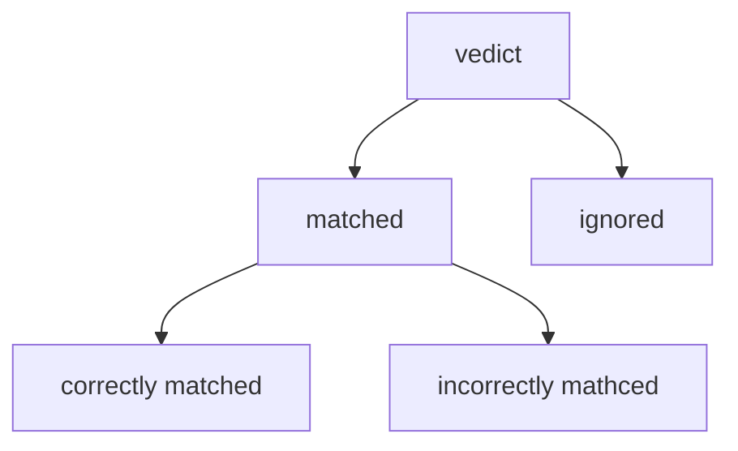

# Header 1

This is awesome!!!

```cpp
void main() {
    std::cout<<'Hello world from jekyll..'
}
```


```mermaid
graph TD;
	V[vedict] --> M[matched]
	V --> I[ignored]
	M --> CM[correctly matched]
	M --> IM[incorrectly mathced]

```
